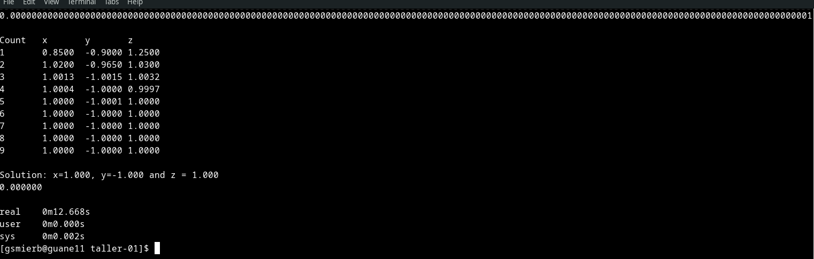
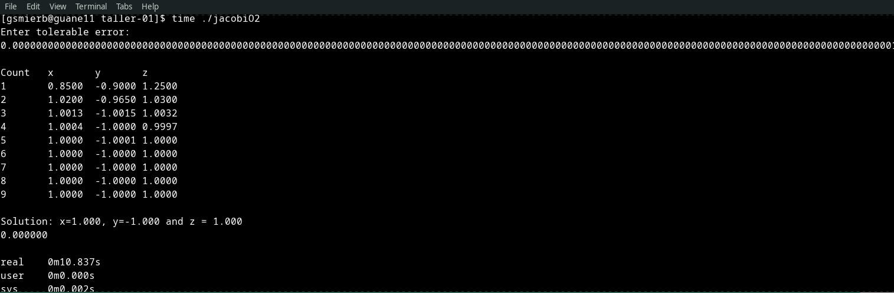
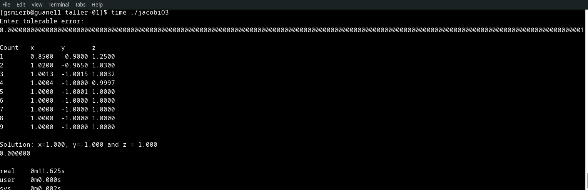
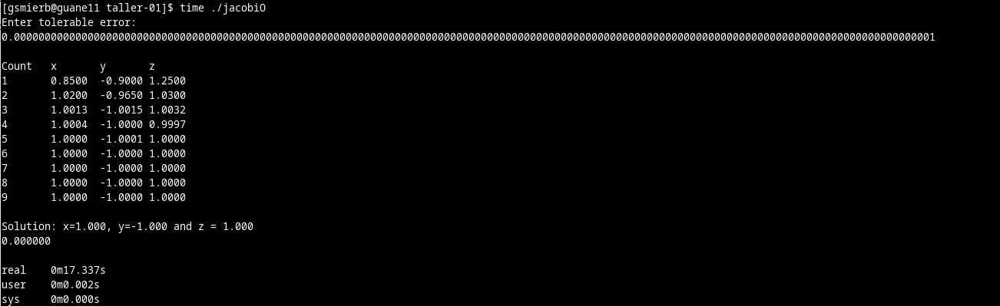
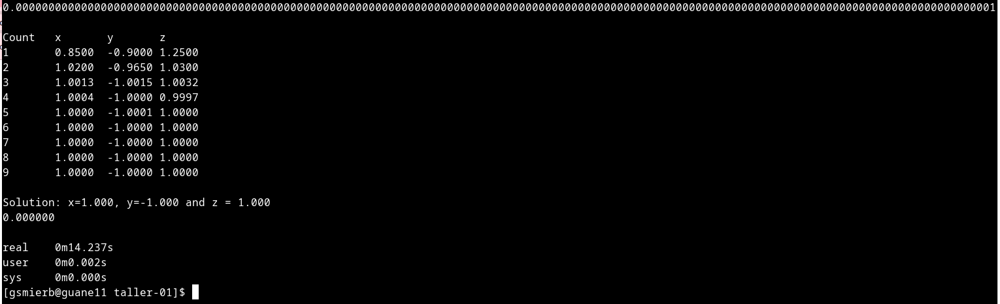
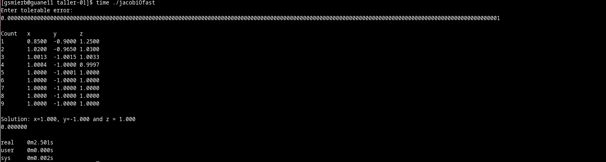
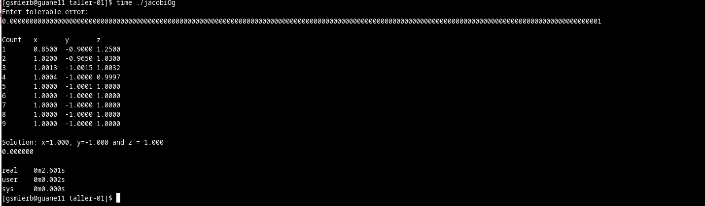
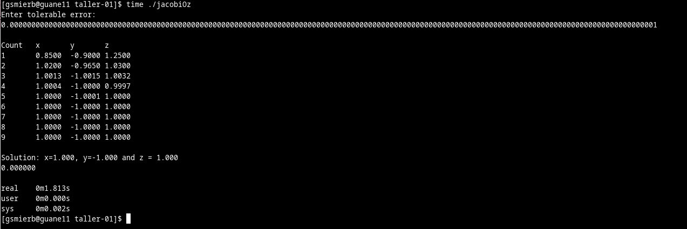
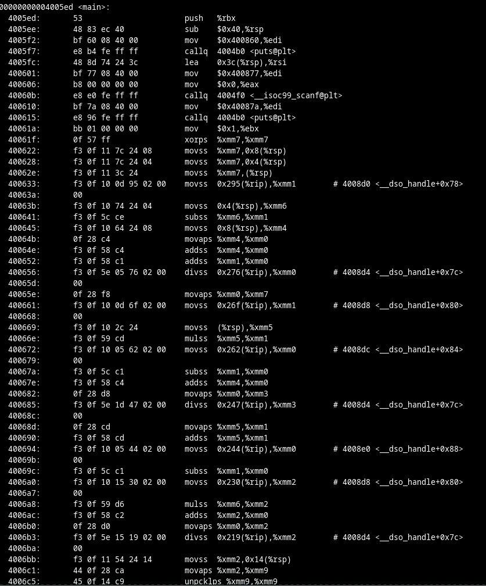
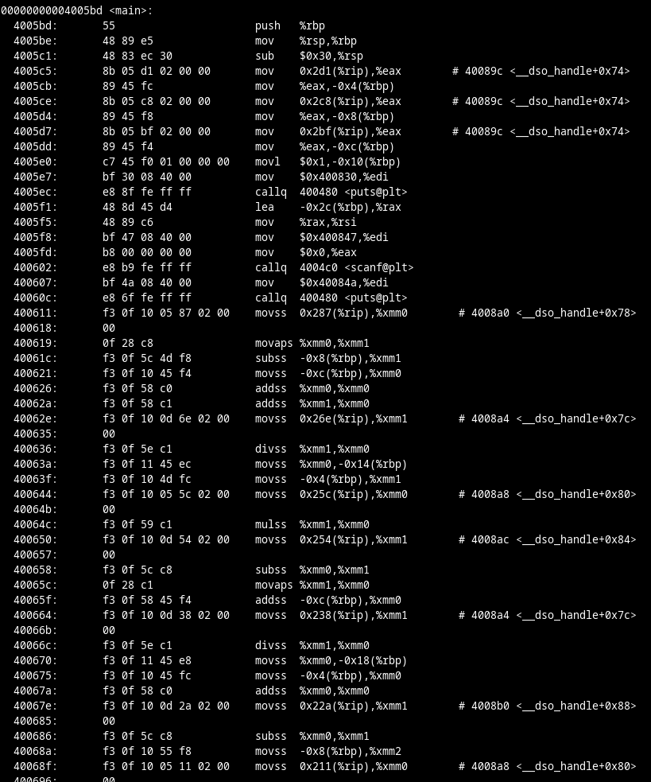

<h3>Taller Inicial de Compilación, Ejecución y Uso de Optimizadores</h3>
El siguiente taller se analizaron las distintas banderas de optimazación del compilador <strong>gcc</strong> sobre el algoritmo de Jacobi para solucion de ecuaciones lineales
<h4>Bandera -O1</h4>

Esta bandera optimiza a nivel del tamaño de instrucciones y el tiempo de ejecución que en este caso por el rendimiento de la ejecución se hace en milesimas de segundo
<h4>Bandera -O2</h4>

Esta al igual que la anterior optimiza mas que no involucran un proceso de compensacion entre el espacio y la velocidad.
<h4>Bandera -O3</h4>

Esta optimiza aún mas que la anterior implementando optimizaciones de las anteriores.
<h4>Bandera -O</h4>

Esta bandera es la misma que la -O1 ya que funciona como su abreviatura.
<h4>Bandera -O0</h4>

Esta es la bandera default sin optimizaciones
<h4>Bandera -Ofast</h4>

Esta bandera no tiene en cuenta las normas de estricto cumplimiento permitiendo todas la optimizaciones de -O3
<h4>Bandera -Og</h4>

Esta bandera optimiza la experiencia de depuracion mejor que la default adicionando mejores tiempos de compilacion.
<h4>Bandera -Oz</h4>

Esta bandera optimiza agresivamente el tamaño de instrucciones sobre la velocidad, por esta razon no es la mas rapida.
<h4>En general todas optimizan tiempos que no pueden verse bien reflejados por la complejidad del algoritmo pero es ligeramente notoria la clase de optimizacion da cada bandera -O</h5>


<h5>Al ver las optimizaciones a nivel de lenguaje ensamble se nota como las instrucciones se reducen o se utiliza otro tipo de operaciones para mejorar la velocidad</h5>
<h4>4. El algoritmo que probe para optimizarlo esta escrito en C++ se llama <strong>matmulti.cpp</strong>``` y multiplica las matrices con punteros, lo optimicé con las banderas -O al igual que en C y a nivel de velocidad aumenta sustancialmente como el numero de sus instrucciones que en -O1 
van hasta 590 instrucciones se reducen a 517 con la bandea -Oz, las compilaciones se encuentran en la carpeta mat_multiply
</h4>
